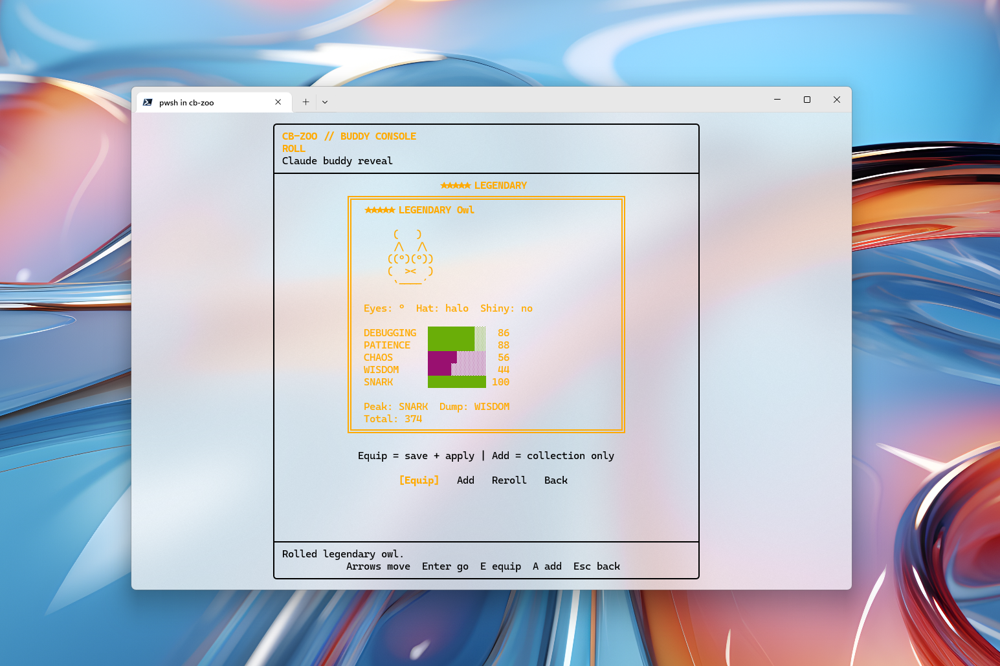
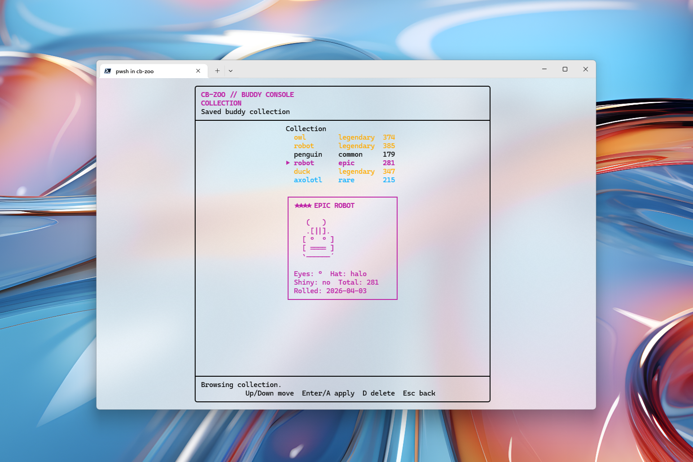

# cb-zoo

`cb-zoo` is a zero-dependency Node.js CLI and terminal UI for rolling, collecting, and applying Claude Code buddies.

It is a small `Claude Code` companion manager with a retro TUI, gacha-style roll flow, local collection tracking, and backup/restore support for Claude UUID state.

Keywords: `Claude Code`, `buddy`, `companion`, `terminal UI`, `TUI`, `CLI`, `gacha`, `Node.js`, `UUID`, `collection`.

## Demo

- [Watch the demo video](./media/2026-04-03%2013-33-27.mp4)

### Roll Screen



### Collection Screen



## Features

- Default interactive terminal UI for rolling and browsing buddies
- Fast plain CLI flow with `--quick` and `--plain`
- Current buddy inspection with UUID-derived traits plus stored profile data
- Local collection saved in `~/.cb-zoo/collection.json`
- Backup and restore flow for the original Claude UUID
- Zero runtime npm dependencies

## Install

```bash
npm install -g cb-zoo
```

Or run it without a global install:

```bash
npx cb-zoo --help
```

## Requirements

- Node.js 18+
- Claude Code initialized at least once so its account state file exists, usually `~/.claude.json` or `$CLAUDE_CONFIG_DIR/.claude.json`

## Quick Start

```bash
cb-zoo
cb-zoo --quick
cb-zoo --current
cb-zoo --collection
cb-zoo --backup
cb-zoo --restore
```

## Commands

- `cb-zoo`
  Opens the default interactive TUI in a real terminal.
- `cb-zoo --quick`
  Uses the fast plain reveal flow.
- `cb-zoo --plain`
  Forces the legacy non-TUI CLI flow.
- `cb-zoo --current`
  Shows the current buddy by merging stored profile data with UUID-derived traits.
- `cb-zoo --collection`
  Shows the saved collection.
- `cb-zoo --set-name "Nova"`
  Updates the stored companion name.
- `cb-zoo --set-personality "Calm under pressure."`
  Updates the stored companion personality.
- `cb-zoo --backup`
  Creates the UUID backup if it does not already exist.
- `cb-zoo --restore`
  Restores the backed-up UUID.

## Safety Notes

- The tool edits `oauthAccount.accountUuid` for rerolls and can also edit `companion.name` and `companion.personality` for the current stored buddy.
- The original UUID is backed up to `~/.cb-zoo/backup.json` on first run.
- Claude Code does not document this file schema as a stable public API, so future releases may change it.
- Re-authenticating Claude Code can overwrite the rerolled UUID, so keep the backup.

## For Maintainers

- Manual release steps live in [docs/deployment-guide.md](./docs/deployment-guide.md).
- Local release gate: `npm run release:check`
- CI workflow: [`.github/workflows/ci.yml`](./.github/workflows/ci.yml)
